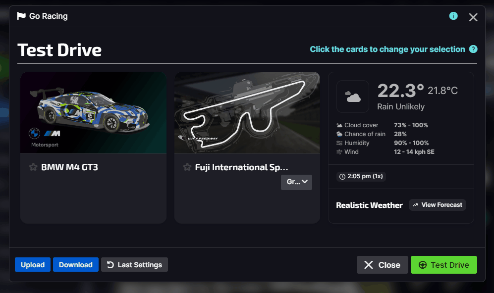

  

  

  

  An unofficial extension for the iRacing UI that adds some quality of life features for drivers everywhere.

## 🚀 Features

### ⏰ Queue for future races where registration is not open yet

### 💾 Load/save/share test drive & hosted config as json file

### 🏁 Green join bar shows the season and session type on the button

### Other stuff
:heavy_check_mark: Automatically launch sim for sessions.  
:heavy_check_mark: Automatically forfeit sessions after x minutes.  
:heavy_check_mark: Automatically close notifications after x seconds.  
:heavy_check_mark: Hide sidebars & collapse menu for more screen real estate.

## Planned
:black_circle: Hide iRating everywhere.  
:black_circle: Play notification sound when Race session is available.

Why not [suggest a feature](https://github.com/jason-murray/irefined/issues/new?template=feature_request.md)?

## Usage & Download

1. Close the iRacing UI.
2. Download the [installer](https://github.com/jason-murray/irefined/releases/latest/download/iRefined-win-Setup.exe) and run it.
3. The installer will launch the iRacing UI with iRefined automatically when it's finished. You will also have a shortcut to iRefined on the desktop and in the start menu.
4. Once the UI has launched you'll find the iRefined queue & log bar at the bottom of the screen, and the settings button (rocket) in the top right.
5. Many of the features are disabled to start with, open the settings to turn them on.

> [!TIP]
> Make sure to start the iRacing UI with the `iRefined` shortcut every time you open iRacing!

## Common Issues

*Opening the settings sometimes shows the latest announcements screen.*  
This can usually be sorted by closing the pop up window and clicking the settings button again.

*Feature x isn't working properly.*  
Because the iRacing UI is essentially a website loaded from the internet, iRacing often roll out changes silently. This can lead to some features breaking without notice.
Luckily iRefined takes the same approach and can also load fixes without needing to be explicitly updated by the user. If you find something that's not working right, please [create an issue](https://github.com/jason-murray/irefined/issues/new?template=bug_report.md).

## Contributing
WIP

### Build Launcher
`pipenv run cxfreeze build --target-dir=dist`
